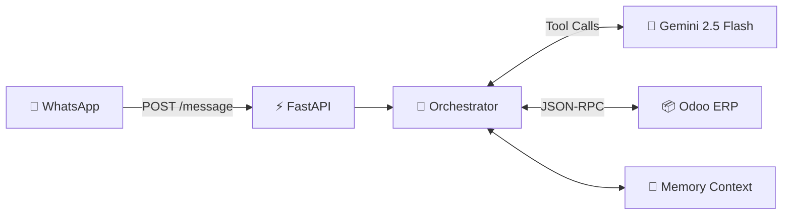
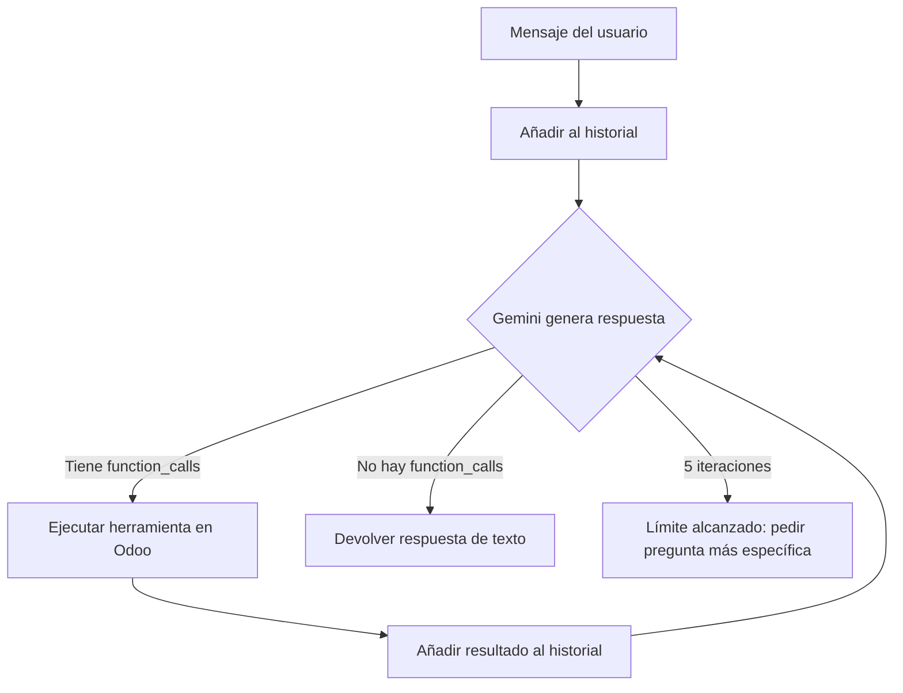

# NexttiAi — Análisis Completo del Proyecto

## Visión General

**NexttiAi** es un **microservicio FastAPI** que actúa como un **agente autónomo de IA** para conectar **WhatsApp**, **Gemini 2.5 Flash** y **Odoo ERP**. Permite a los usuarios hacer preguntas en lenguaje natural (por WhatsApp) sobre su empresa, y la IA las traduce a consultas/acciones sobre Odoo.

## Estructura de Directorios

| Directorio | Propósito |
|---|---|
| `api/` | Endpoints FastAPI y schemas Pydantic |
| `core/` | Configuración ([.env](file:///c:/Users/FlareBit/OneDrive/Documentos/python/NexttiAi/.env)) y **Orchestrator** (cerebro del agente) |
| `connectors/` | Cliente HTTP asíncrono para Odoo (JSON-RPC) |
| `llm/` | Wrapper de Gemini (placeholder, no se usa activamente) |
| `storage/` | Memoria de conversación en RAM (historial por usuario) |
| `tools/` | Definiciones de herramientas para Gemini + ejecutores de cada una |

---

## Componentes de Código

### 1. Punto de Entrada — [main.py](file:///c:/Users/FlareBit/OneDrive/Documentos/python/NexttiAi/main.py)

Arranca FastAPI en el puerto **8005** con Uvicorn. Incluye el router de [api/endpoints.py](file:///c:/Users/FlareBit/OneDrive/Documentos/python/NexttiAi/api/endpoints.py).

---

### 2. API Layer

#### [endpoints.py](file:///c:/Users/FlareBit/OneDrive/Documentos/python/NexttiAi/api/endpoints.py)
Único endpoint `POST /message` que recibe `{user_id, message}` desde WhatsApp, invoca al orchestrator, y devuelve `{reply, tool_used}`.

#### [schemas.py](file:///c:/Users/FlareBit/OneDrive/Documentos/python/NexttiAi/api/schemas.py)
Modelos Pydantic: [MessageRequest](file:///c:/Users/FlareBit/OneDrive/Documentos/python/NexttiAi/api/schemas.py#5-8) (entrada) y [MessageResponse](file:///c:/Users/FlareBit/OneDrive/Documentos/python/NexttiAi/api/schemas.py#10-14) (salida).

---

### 3. Core — El Cerebro

#### [config.py](file:///c:/Users/FlareBit/OneDrive/Documentos/python/NexttiAi/core/config.py)
Carga 5 variables de entorno con `pydantic-settings`: credenciales de Odoo + API key de Gemini.

#### [orchestrator.py](file:///c:/Users/FlareBit/OneDrive/Documentos/python/NexttiAi/core/orchestrator.py) ⭐
**El componente central del proyecto.** Implementa un **bucle de agente autónomo** (hasta 5 iteraciones):

**System prompt** (`mapa_odoo`): Define los modelos de Odoo disponibles, campos clave, métodos permitidos y reglas de uso de herramientas.

---

### 4. Conector Odoo

#### [odoo_client.py](file:///c:/Users/FlareBit/OneDrive/Documentos/python/NexttiAi/connectors/odoo_client.py)
Cliente asíncrono (httpx) que habla con Odoo via **JSON-RPC**. Tres métodos:
- [authenticate()](file:///c:/Users/FlareBit/OneDrive/Documentos/python/NexttiAi/connectors/odoo_client.py#40-55) → obtiene el UID
- [execute(model, method, args)](file:///c:/Users/FlareBit/OneDrive/Documentos/python/NexttiAi/connectors/odoo_client.py#56-76) → wrapper genérico para `execute_kw`
- [_call()](file:///c:/Users/FlareBit/OneDrive/Documentos/python/NexttiAi/connectors/odoo_client.py#15-39) → transporte JSON-RPC bajo nivel

---

### 5. Herramientas (Tool Calling)

#### [definitions.py](file:///c:/Users/FlareBit/OneDrive/Documentos/python/NexttiAi/tools/definitions.py)
Define **8 herramientas** en formato OpenAPI para Gemini:

| Herramienta | Propósito |
|---|---|
| [get_partner_by_phone](file:///c:/Users/FlareBit/OneDrive/Documentos/python/NexttiAi/tools/executors.py#192-219) | Buscar cliente por teléfono |
| [get_top_selling_products](file:///c:/Users/FlareBit/OneDrive/Documentos/python/NexttiAi/tools/executors.py#165-191) | Top productos vendidos |
| [get_total_sales_and_orders](file:///c:/Users/FlareBit/OneDrive/Documentos/python/NexttiAi/tools/executors.py#132-164) | Resumen financiero global |
| [get_top_customers](file:///c:/Users/FlareBit/OneDrive/Documentos/python/NexttiAi/tools/executors.py#104-131) | Clientes con mayor volumen |
| [execute_odoo_query](file:///c:/Users/FlareBit/OneDrive/Documentos/python/NexttiAi/tools/executors.py#68-103) | **Consulta universal** (search_read, search_count, read_group) |
| [create_odoo_record](file:///c:/Users/FlareBit/OneDrive/Documentos/python/NexttiAi/tools/executors.py#46-67) | Crear registros (clientes, leads, etc.) |
| [update_odoo_record](file:///c:/Users/FlareBit/OneDrive/Documentos/python/NexttiAi/tools/executors.py#25-45) | Actualizar campos de registros existentes |
| [execute_odoo_action](file:///c:/Users/FlareBit/OneDrive/Documentos/python/NexttiAi/tools/executors.py#5-23) | Ejecutar acciones de negocio (confirmar pedidos, publicar facturas) |

#### [executors.py](file:///c:/Users/FlareBit/OneDrive/Documentos/python/NexttiAi/tools/executors.py)
Implementación de cada herramienta. Incluye guardias de seguridad (ej. `metodos_permitidos` en [execute_odoo_query](file:///c:/Users/FlareBit/OneDrive/Documentos/python/NexttiAi/tools/executors.py#68-103)). Todas son funciones `async` que usan el [OdooClient](file:///c:/Users/FlareBit/OneDrive/Documentos/python/NexttiAi/connectors/odoo_client.py#7-76).

---

### 6. Storage

#### [memory_context.py](file:///c:/Users/FlareBit/OneDrive/Documentos/python/NexttiAi/storage/memory_context.py)
Historial de conversación **en memoria RAM** (diccionario global), limitado a los últimos **20 mensajes** por usuario. Se pierde al reiniciar el servidor.

---

### 7. Otros archivos

| Archivo | Descripción |
|---|---|
| [test.py](file:///c:/Users/FlareBit/OneDrive/Documentos/python/NexttiAi/test.py) | Script de pruebas manual (síncrono) que valida consultas directas a Odoo: livechat, top clientes, saldo de ventas, top productos |
| [llm/gemini_client.py](file:///c:/Users/FlareBit/OneDrive/Documentos/python/NexttiAi/llm/gemini_client.py) | Wrapper placeholder de Gemini (no se usa; el orchestrator usa `google-genai` directamente) |
| [.env](file:///c:/Users/FlareBit/OneDrive/Documentos/python/NexttiAi/.env) | Credenciales: `ODOO_URL`, `ODOO_DB`, `ODOO_USERNAME`, `ODOO_PASSWORD`, `GEMINI_API_KEY` |

---

## Stack Tecnológico

| Tecnología | Versión | Uso |
|---|---|---|
| Python | 3.x | Runtime |
| FastAPI | 0.129.2 | Framework web |
| Uvicorn | 0.41.0 | Servidor ASGI |
| google-genai | 1.64.0 | SDK de Gemini (model: `gemini-2.5-flash`) |
| httpx | 0.28.1 | Cliente HTTP async para Odoo |
| pydantic-settings | 2.13.1 | Configuración desde [.env](file:///c:/Users/FlareBit/OneDrive/Documentos/python/NexttiAi/.env) |
| Odoo | v19 (SaaS) | ERP backend |

## Observaciones y Áreas de Mejora Potencial

1. **[llm/gemini_client.py](file:///c:/Users/FlareBit/OneDrive/Documentos/python/NexttiAi/llm/gemini_client.py) no se usa** — el orchestrator instancia `genai.Client` directamente
2. **Memoria volátil** — el historial en RAM se pierde al reiniciar; considerar Redis o base de datos
3. **Sin autenticación en el endpoint** — `POST /message` está abierto
4. **Sin tests automatizados** — [test.py](file:///c:/Users/FlareBit/OneDrive/Documentos/python/NexttiAi/test.py) es un script manual de integración
5. **Timeout del cliente Odoo** es fijo (10s) — podría no ser suficiente para queries grandes
6. **Sin retry/backoff** en llamadas a Odoo ni a Gemini
